```{r setup, include=FALSE}
options(htmltools.dir.version = FALSE)
library(knitr)
knitr::opts_chunk$set(warning = FALSE, message = FALSE)
# options(knitr.table.format = "html")
library(tidyverse)
library(babynames)
library(fontawesome) # from github: https://github.com/rstudio/fontawesome
library(DiagrammeR)
```

layout: true
  
<div class="my-footer"><span>Marmara University/Statistics</span></div>

<!-- this adds the link footer to all slides, depends on my-footer class in css-->

---
name: xaringan-title
class: center
background-image: url("img/franki-chamaki-1K6IQsQbizI-unsplash.jpg")
background-size: cover


# Bilgisayar IV

## Dr. Busenur Kızılaslan | 2021


<!-- this ends up being the title slide since seal = FALSE-->

---
class: right
background-image: url("img/monika-grabkowska-1141662-unsplash.jpg")
background-size: cover

## .fat[Bir bilgisayar] 
## .fat[dersinden] 
## .fat[çok daha] 
## .fat[fazlası!]

---

class: right, middle


# bana ulaşmak için...

  
[`r fa(name = "github")` @busenurk](https://github.com/busenurk)  
[`r fa(name = "link")` googlescholar/busenurkizilaslan](https://scholar.google.com.tr/citations?user=OKlYJEgAAAAJ&hl=tr&oi=ao)  
[`r fa(name = "link")` avesis/busenurkizilaslan](https://avesis.marmara.edu.tr/busenur.sarica)    
[`r fa(name = "paper-plane")` busenur.sarica@marmara.edu.tr](mailto:busenur.sarica@marmara.edu.tr)

---
class: right,bottom,inverse
background-image: url("img/pygmy.jpg")
background-size: cover


## Her çarşamba

--

## Ders | 18:00 - 18:50 

--

## Kahve molası | 18:50 - 19:00 

--

## Ders | 19:00 - 19:50 

---

class: left
# Kaynaklar I
----------------

###📕📗 Kitaplar

[The R Book - Michael J. Crawley](https://www.cs.upc.edu/~robert/teaching/estadistica/TheRBook.pdf)

[R for Data Science - Hadley Wickham, Garrett Grolemund](https://r4ds.had.co.nz)

[Introduction to Data Science - Rafael A. Irizarry](https://rafalab.github.io/dsbook/)

[R Programming for Data Science - Roger D. Peng](https://bookdown.org/rdpeng/rprogdatascience/)

[The Book of R - Tilman M. Davies](https://web.itu.edu.tr/~tokerem/The_Book_of_R.pdf)

[Veri Bilimi - John D. Kelleher, Brendan Tierney](https://www.dr.com.tr/Kitap/Veri-Bilimi/Bilim/Bilim-Tarihi-ve-Felsefesi/urunno=0001900386001)

[Yapay Öğrenme, Yeni Yapay Zeka - Ethem Alpaydın](https://www.dr.com.tr/Kitap/Yapay-Ogrenme-Yeni-Yapay-Zeka/Bilim/Bilim-Tarihi-ve-Felsefesi/urunno=0001900387001?gclid=Cj0KCQiA1pyCBhCtARIsAHaY_5caCdqo9fIsWR7oqvsalW-nCzBDzdAzgueHfA4vf9fyPNwmMIBJ-D4aAqghEALw_wcB&gclsrc=aw.ds)

[Mastering Software Development in R - R. D. Peng, S. Kross, B. Anderson](https://bookdown.org/rdpeng/RProgDA/)

---

class: left
# Kaynaklar II
----------------

###👩🏻‍💻👨🏻‍💻 Eğitimler

[HarvardX - Data Science: R Basics](https://www.edx.org/course/data-science-r-basics) 

[HarvardX - Data Science: Visualization](https://www.edx.org/course/data-science-visualization)

[HarvardX - Data Science: Probability](https://www.edx.org/course/data-science-probability)


---
class: left, middle, inverse
background-image: url("img/davisuko-5E5N49RWtbA-unsplash.jpg")
background-size: cover

# İSTATİSTİK NEDİR ?

---
class: middle, center

# İstatistik veriden öğrenme sanatıdır. 

## Sheldon M. Ross

---
class: middle, right
background-image: url("img/kelli-tungay-2LJ4rqK2qfU-unsplash.jpg")
background-size: cover


### .salt[toplanması] 

--

### .acid[düzenlenmesi] 

--

### .heat[analizi]

--

### .salt[yorumlanması] 

--

### .fat[sunulması]
---

# Ders İçeriği  🚀

------------

## 🌍 Analiz

--

## 🌍 Sunu

--

## 🌍 Okuma / Tartışma

--

## 🌍 Öneriler

---
class: inverse
background-image: url("img/todd-quackenbush-x5SRhkFajrA-unsplash.jpg")
background-size: cover

# Ön koşullar

---
class: left, middle, inverse
background-image: url("img/github.png")
background-size: cover


---
class: middle, right
background-image: url("img/kaggle.png")
background-size: cover


---
class: middle, left, inverse
background-image: url("img/nick-fewings-C2zhShTnl5I-unsplash.jpg")
background-size: cover

#Ne işime yarayacak?

---
class: middle, right
background-image: url("img/gavin-allanwood-rObq1WBp_Ew-unsplash.jpg")
background-size: cover


---
class: middle, right
background-image: url("img/freestocks-11SgH7U6TmI-unsplash.jpg")
background-size: cover

---
class: middle, right
background-image: url("img/bao-menglong-yXkKfvGaipw-unsplash.jpg")
background-size: cover

---
class: middle, right
background-image: url("img/thisisengineering-raeng-qI7USKbZY_A-unsplash.jpg")
background-size: cover

---
class: middle, right
background-image: url("img/possessed-photography-g29arbbvPjo-unsplash.jpg")
background-size: cover

---

class: right, inverse
background-image: url("img/jason-tuinstra-551608-unsplash.jpg")
background-size: cover


#Yapay öğrenmenin (machine learning) altında yatan ana teori istatistiğe dayanır.

Ethem Alpaydın, "Yapay Öğrenme, Yeni Yapay Zeka", (2020), 35.

---
class: middle, right
background-image: url("img/rmarkdown.png")
background-size: cover
---

class: middle, right
background-image: url("img/rpres1.png")
background-size: cover
---

class: left, inverse
background-image: url("img/jon-tyson-hhq1Lxtuwd8-unsplash.jpg")
background-size: cover

# Soru / Cevap

---
class: inverse, left, bottom
background-image: url("img/ev-gpjvRZyavZc-unsplash.jpg")
background-size: cover

# .salt[Veri Bilimi]

---
  
## Veri bilimi, yapay öğrenme ve veri madenciliği terimleri sıklıkla birbirinin yerine kullanılsa da veri biliminin etki alanı daha geniştir.
  
<br>
  
--
  
.salt[Yapay Öğrenme (Machine Learning)]

--
  
.fat[Veri Madenciliği (Data Mining)]

--
  
.acid[Veri Bilimi (Data Science)]

---
  
.salt[Yapay Öğrenme (Machine Learning)]

Veriden örüntüler çıkarmak amacıyla algoritmaların tasarlanmasına ve değerlendirilmesine odaklanır.

<br>
  
--
  
.fat[Veri Madenciliği (Data Mining)]

**Yapılandırılmış (structured)** verinin analizi ile uğraşır.

<br>
  
--
  
.acid[Veri Bilimi (Data Science)]

Tüm bu yapıları dikkate almakla birlikte **yapılandırılmamış** verilerin yakalanması (data capturing), temizlenmesi ve dönüştürülmesini de gerçekleştirir.

--

**Yapılandırılmamış** veri kümelerinin depolanması, işlenmesi için büyük veri teknolojilerini kullanır.

--

Veri etiği ve mevzuatına dair sorularla ilgilenir.

---
  
`Yapılandırılmış veri (structured data);` her örneği aynı yapıya (yani nitelik kümesine) sahip olan ve tablolarda depolanan verilerdir.

🍎 Demografik veri

<br>
  
--
  
`Yapılandırılmamış veri (unstructured data);` veri kümesindeki her bir örneğin kendine ait bir içsel yapısına sahip olabildiği ancak bu yapıların her örnekte aynı olmak zorunda olmadığı verilerdir.

🍎 Web sayfalarına dair veri

<br>
  
--
  
Yapılandırılmamış veriler yapılandırılmış verilerden daha yaygındır.

<br>
  
--
  
Bilgisayarlı görme (Computer vision), dijital sinyal işleme (digital signal processing), doğal dil işleme (natural language processing) vb. yöntemler kullanılarak yapılandırılmamış veriden yapılandırılmış veri elde edilebilmektedir.

<br>
  
--
  
Bu dönüştürme işlemlerini uygulamak zaman ve maliyet açısından verimi düşürmektedir.

---
class: middle

.pull-left[

###Yapılandırılmamış veri zaman ve maliyet kaybı yaratıyorsa neden üzerine çalışılıyor?
      
<br>
        
###NoSQL nedir?

<br>

### .JSON nedir?
        
]


.pull-right[
    

    
]

---

.salt[Veri biliminin kullanımındaki artış nedenleri]

<br>

🌵 Büyük veri (big data)

--

🌵 Sosyal medya

--

🌵 Bilgi işlemin gücündeki hızlanma

--

🌵 Bilgisayar belleğinin maliyetindeki düşüş

--

🌵 Derin öğrenme (deep learning) gibi yöntemlerin gelişimi
  
--

<br>

***Kuruluşlar için veri toplamak, depolamak ve işlemek hiçbir zaman bugünkü kadar kolay olmamıştır.***


--

<br>

***Veri kullanımına ve bireysel mahremiyete ilişkin etik güçlerin aşılması hiçbir zaman bugünkü kadar aciliyet kazanmamıştır.***

---
background-image: url("img/bernard-hermant-_THpp4Hs8LU-unsplash.jpg")
background-size: cover

###İnsan, üçten fazla niteliği ve etkileşimini yorumlamakta zorlanırken veri bilimi yüzlerce, binlerce hatta milyonlarca nitelik arasındaki örüntüleri bulmak istediğimizde faydalıdır.

<br>

--

###Günümüzde çoğu veri bilimi projesi, yapay öğrenme yaklaşımının doğru tahmin modelleri oluşturma hedefiyle daha fazla örtüşmekte, veriyi açıklama maksatlı istatistik odağıyla daha az ilgilenmektedir.

<br>

--

###⚠️⚠️⚠️ Betimsel ve Çıkarımsal İstatistik

---
class:inverse
background-image: url("img/nasa-Q1p7bh3SHj8-unsplash.jpg")
background-size: cover

## Veri Bilimci (Data Scientist) Kimdir?

---

.salt[👩🏻‍💻👨🏻‍💻 Veri bilimci,] 

<br>

####veri tabanlarındaki verileri uyumlandırma ve işleme becerilerine sahip olmalı,

--

<br>

####web verisini kazıma (web scraping), temizleme ve birleştirmesi kadar yapılandırılmamış metin ve imajlarla uğraşıp onları da işleyebilmeli,

--

<br>

####veri görselleştirme konusuna hakim olmalı ve proje çıktılarını teknik alt yapısı olmayan meslektaşlarının anlayabileceği şekilde aktarabilmeli,

<br>

--

####veriyi yasal sınırlar dahilinde ve uygun bir şekilde kullanacaksa ilgili yönetmelikleri anlamalı ve çalışmasının yol açabileceği sonuçları değerlendirebilecek etik anlayışa sahip olmalıdır.

---

.heat[Girdiler çöpse çıktılar da çöp olur!]

<br>

--

###Veri biliminin başarılı olması için verinin nasıl yaratıldığı önemlidir. (değişken seçimi, veri kalitesi)

<br>

--

###Veri bilimi sürecinin sonuçlarına anlam kontrolü uygulanması gerekir, zira bilgisayarın veride bir örüntü saptamış olması, bunun sürece dair gerçek bir öngörü sunacağı anlamına gelmez. (yanlı tercihlerin çıktısı olabilir.)

---


###İnsan yönetimi olmaksızın, bir veri bilimi projesi hedeflerine ulaşmakta başarısız olacaktır. İnsan yönetimi gerektiren aşamalar;


###🔺 Sorunu çerçevelemek

--

###🔺 Veriyi tasarlayıp hazırlamak

--

###🔺 Hangi ML yönteminin uygun olduğunu belirlemek

--

###🔺 Analiz sonuçlarını eleştirel gözle yorumlamak

--

###🔺 Çıktılarla en uygun eylemi planlamak

---
background-image: url("img/olia-gozha-J4kK8b9Fgj8-unsplash.jpg")
background-size: cover

.heat[McKinsey Global Institute Raporu (2011)]

###ABD'de veri bilimi ve analiz yetilerine sahip 140 bin - 190 bin çalışan ihtiyacı

###Veri bilimi ve analitik yorumlama sürecini yönetip yorumlayabilecek 1.5 milyon yönetici ihtiyacı (Manyika, Chui, Brown vd. 2011)

--

.heat[McKinsey Global Institute Raporu (2016)]

###Kısa dönemde tahminen 250 bin veri bilimci açığı öngörüsü (Henke, Bughin, Chui vd. 2016)

---

.salt[🎅🏼 Veri Bilimi Hakkındaki Mitler]

<br>

###1️⃣ Veri biliminin, sorunlarımıza cevap bulması için verilerimiz üzerine salıvereceğimiz otonom bir süreç olduğu inancı

--

###2️⃣ Her veri bilimi projesinin büyük veriye ve derin öğrenmeyi kullanmaya ihtiyacı olduğu

--

###3️⃣ Modern veri bilimi yazılımlarının kullanımının kolay olduğu ve bu yüzden veri bilimci olmanın kolay olduğu

--

###4️⃣ Veri biliminin hızlıca kendi maliyetini karşıladığı


---
class: middle

 


# GitHub

<br>

--

# GitHub Class

<br>

--

# Gönüllüler (3)❓

---
class: inverse
background-image: url("img/magda-v-yrrR17aAGiQ-unsplash.jpg")
background-size: cover


#Açıklayıcı Veri Analizi 

##(Exploratory Data Analysis) 

---

.salt[💻 EDA]

<br>

Exploratory Data Analysis (EDA), veri görselleştirme ve dönüştürme işlemleri yardımıyla keşifsel veri analizi olarak tanımlanabilir.

<br>

--

EDA bir döngüdür ve aşağıdaki adımları izler;

--

🔻 Veri ile ilgili sorular oluşturulur.

--

🔻 Veriler görselleştirilerek, dönüştürülerek ve modellenerek yanıtlar aranır.

--

🔻 Soruları düzeltmek ve / veya yeni sorular oluşturmak için öğrenilen bilgiler kullanılır.

<br>
--

EDA katı kuralları olan bir süreç değildir, ilk aşamalarda aklınıza gelen her soruyu araştırmakta özgürsünüz.

--

EDA veri analizinin önemli bir parçasıdır.

---

.fat[💻 Sorgulayıcı Yaklaşım]

<br>

EDA amacı verinin anlaşılmasıdır, bu amaçla soracağınız soruları araç olarak kullanabilirsiniz.

<br>

--

Soru dikkatinizi veri kümenizin belirli bir bölümüne odaklar ve hangi grafikleri, modelleri veya dönüşümleri yapacağınıza karar vermenize yardımcı olur.

<br>

--

.saltinline[Hedef, yaratıcı sorular sorabilmek!]

<br>
--

Sorular için bir kalıp olmamakla birlikte temel iki soru düşünmenize yardımcı olacaktır.

--

🍏 Değişkenler arasında ne tür bir değişkenlik mevcut?

--

🍎 Değişkenler arasında ne tür bir kovaryans mevcut?


---
class: center, middle

.pull-left[

###.salt[Variable]

<br>

###.salt[Value]
] 

.pull-right[

###.salt[Observation] 

<br>

###.salt[Tabular Data]
]

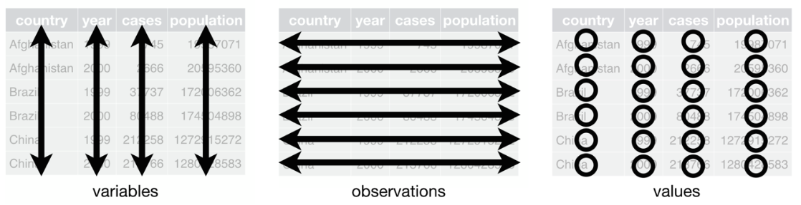

---

class: center, middle
background-image: url("img/mel-poole-eo5Hrzyb4D0-unsplash.jpg")
background-size: cover

#.heat[TIDY DATA]

### with TIDYVERSE

---

####.salt[Referanslar]


.pull-left[


**Hadley Wickham**

@RStudio

<br>

[📺 Effective frameworks for thinking about data analysis-data science problems in R](https://rstudio.com/resources/webinars/effective-frameworks-for-thinking-about-data-analysis-data-science-problems-in-r/)
]

.pull-right[


**Garrett Grolemund**

@RStudio

<br>

[📓 Data Science with R](https://garrettgman.github.io/tidying/)


[📺 Tidyverse visualization manipulation basics](https://rstudio.com/resources/webinars/tidyverse-visualization-manipulation-basics/)

]


---

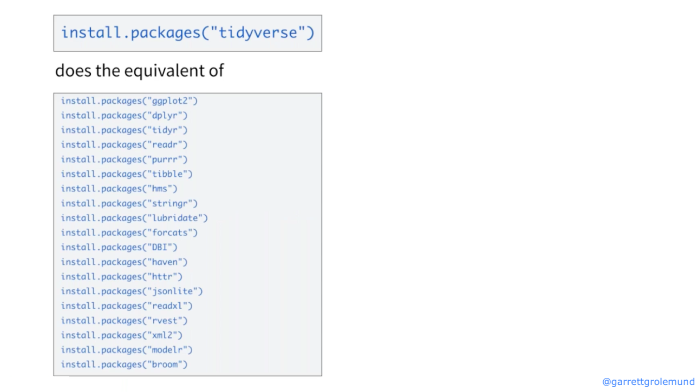
---


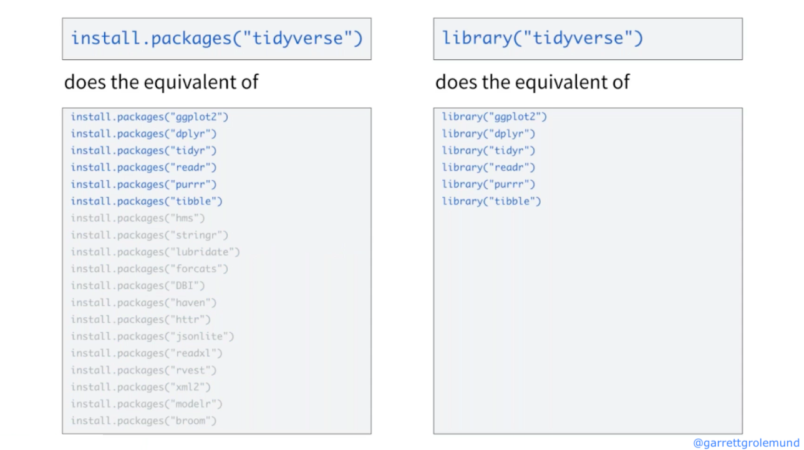
---


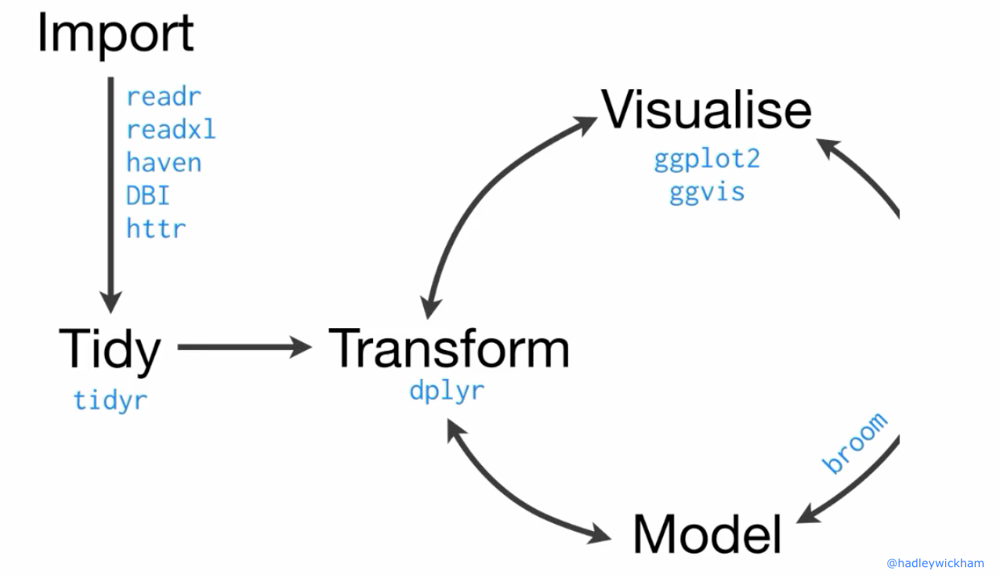

---
####.salt[Pipe Operator]

--------------

<br>

.pull-left[

####x %>% f(y)

#### 🌱 f(x,y)


<br>

#### x %>% f(z,.)

#### 🌱 f(z,x)

<br>


####x %>% f(y) %>% g(z)

#### 🌱 g(f(x,y),z)

]

.pull-right[

<br>


]
---

#### .salt[Tidy data; veri analizini kolaylaştıran veri tipi]

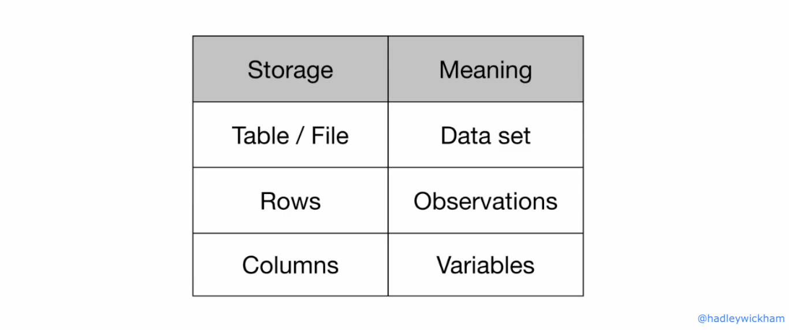

---

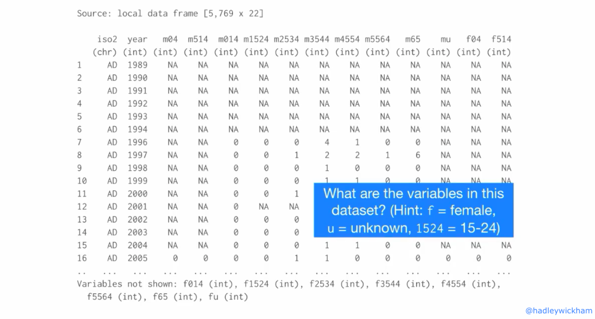

---

####.salt[Data set 1]

<br>

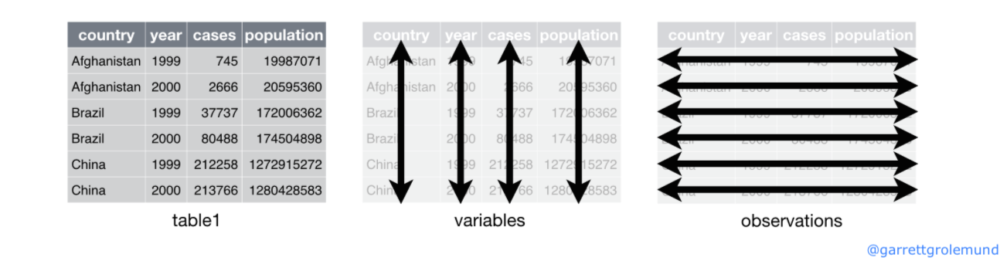


---
####.salt[Data set 2]

<br>

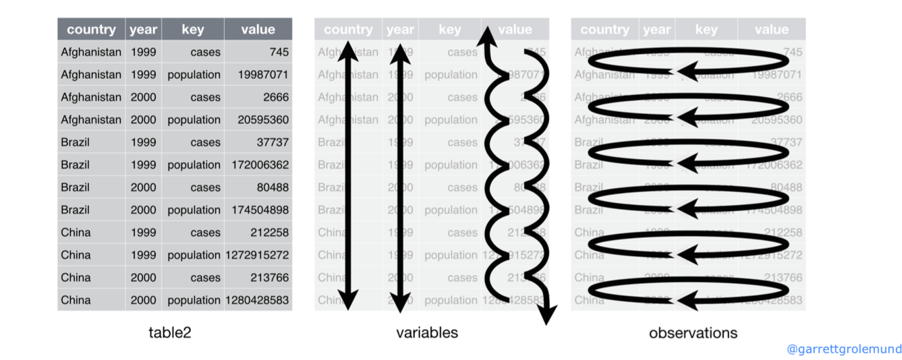
---
####.salt[Data set 3]

<br>

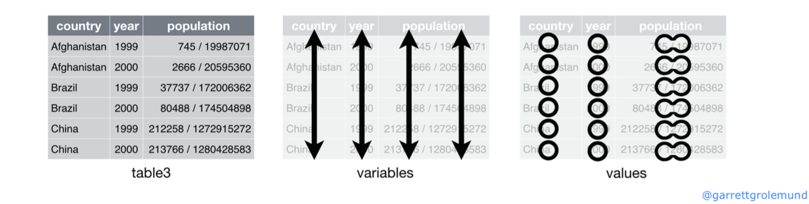

---
####.salt[Data set 4 - 5]

<br>

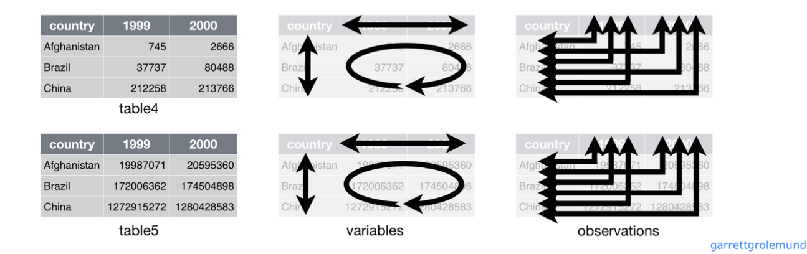

---
class:middle
background-image: url("img/ben-neale-29w9FiMWSr8-unsplash.jpg")
background-size: cover


#.acid[KEY]     

<br>

#.acid[VALUE]

---

####.fat[🎯 spread()]

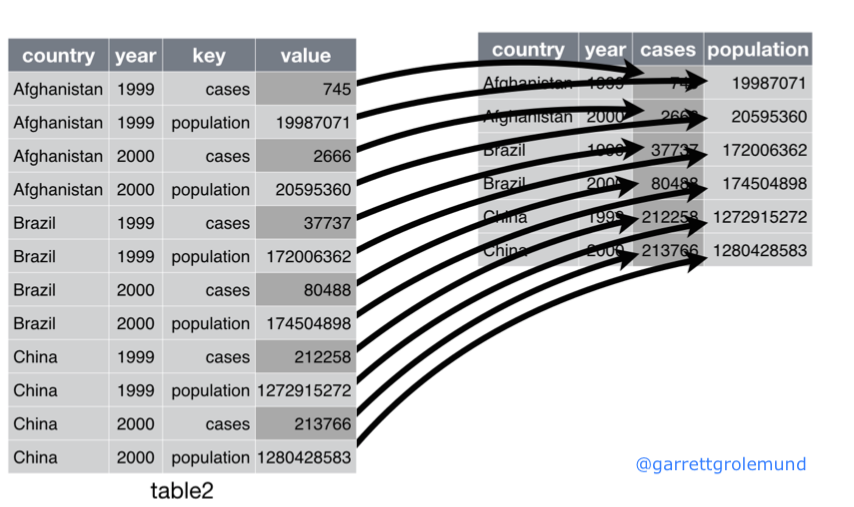

---

####.fat[🎯 gather()]

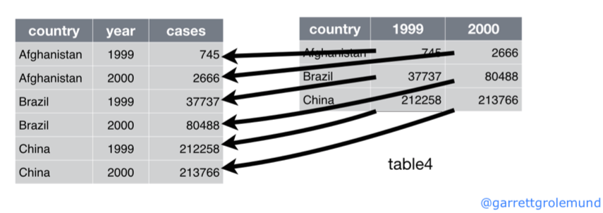
---


---

##2014 World Health Organization Global Tuberculosis Report

Data reported between 1995 and 2013 sorted by country, age, and gender [📖](www.who.int/tb/country/data/download/en/)

<br>

.pull-left[

`rel` stands for cases of relapse

`ep` stands for cases of extrapulmonary TB

`sn` stands for cases of pulmonary TB that could not be diagnosed by a pulmonary smear (smear negative)

`sp` stands for cases of pulmonary TB that could be diagnosed be a pulmonary smear (smear positive)

`m` male, `f` female

]

.pull-right[

`014` stands for patients that are 0 to 14 years old

`1524` stands for patients that are 15 to 24 years old

`2534` stands for patients that are 25 to 34 years old

`3544` stands for patients that are 35 to 44 years old

`4554` stands for patients that are 45 to 54 years old

`5564` stands for patients that are 55 to 64 years old

`65` stands for patients that are 65 years old or older
]

---

class:middle,center
background-image: url("img/joe-woods-4Zaq5xY5M_c-unsplash.jpg")
background-size: cover


# .heat[CHEAT SHEET]  

#[🗝](https://github.com/rstudio/cheatsheets/blob/master/data-import.pdf)
---


---

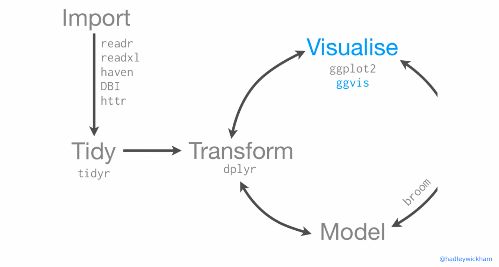


